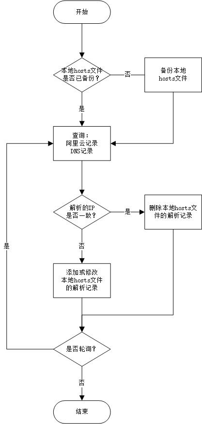

# AliDDNS 阿里动态域名脚本

提供阿里域名的动态域名更新、快速查询、以及更新本地DNS结果的轻量脚本

## 解析记录的更新逻辑

- 如果阿里云记录的最新IP与DNS服务器上查询到的IP不一致，则认为该动态域名的解析已经发生变化，此时判断文件是否有相关解析记录：
  - 如果指定的文件上没有相关域名的解析记录，则`添加`从阿里云API上查询到的最新的解析记录；
  - 如果指定的文件上存在相关域名的解析记录，则`更新`从阿里云API上查询到的最新的解析记录；
- 如果阿里云记录的最新IP与DNS服务器上查询到的IP一致，则认为该动态域名的解析未发生变化，为防止脚本后台运行时异常退出导致解析没有及时更新（影响其它依赖该解析的App），会自动`删除`指定hosts文件中的解析记录；

### 本地hosts的更新逻辑流程图



## 使用方法

### 1.查询阿里域名的记录IP，当前DNS的记录IP以及查询端的公网IP

```ShellSession
[root@SZV-VM ~]$ ./aliddns.sh home.mydomain.com
External IP: 218.37.12.42
Nslookup IP: 116.21.220.238 home.mydomain.com
AliDNS Record IP: 116.21.220.238 home.mydomain.com
```

### 2.查询阿里域名的记录IP，当前DNS的记录IP以及查询端的公网IP，并将记录IP`添加`或`更新`或`删除`到指定的文件（如本地hosts）

```ShellSession
#注：输出文件需已经创建，修改前会自动创建备份文件
[root@SZV-VM ~]$ ./aliddns.sh home.mydomain.com output.txt
External IP: 218.37.12.42
Nslookup IP: 116.21.220.238 home.mydomain.com
AliDNS Record IP: 116.21.220.238 home.mydomain.com
output.txt.bak created
No record can be removed, skip
```

### 3.轮询查询阿里域名的记录IP，，并将记录IP`添加`或`更新`或`删除`到指定的文件（如本地hosts）

```ShellSession
#注：输出文件需已经创建，修改前会自动创建备份文件；
[root@SZV-VM ~]$ ./aliddns.sh home.mydomain.com /etc/hosts 30
External IP: 218.37.12.42
Nslookup IP: 116.21.220.238 home.mydomain.com
AliDNS Record IP: 116.21.220.238 home.mydomain.com
hosts.bak created
No record can be removed, skip
External IP: 218.37.12.42
Nslookup IP: 116.21.220.238 home.mydomain.com
AliDNS Record IP: 116.21.220.238 home.mydomain.com
hosts.bak is already created, skip bakup operation.
No record can be removed, skip
```

## 版本历史

2018-06-01 初始版本 V1

1. 通过阿里云的API，提供阿里云域名服务的单一域名记录的IP的快速查询，无DNS缓存等待时间限制；

2. 提供本地hosts文件的更新、删除功能；

3. 提供循环检查域名解析更新状态；
