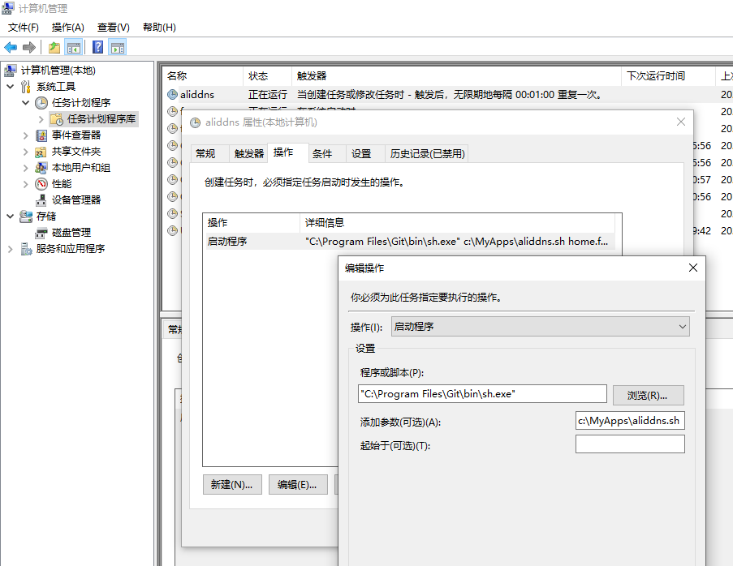

# AliDDNS 阿里动态域名脚本

提供阿里域名的动态域名更新、快速查询、以及更新本地DNS结果的轻量脚本。本脚本兼容Windows环境（git bash）以及各种Linux发行版本。

阿里云目前提供的免费域名解析，最小TTL是600，也就是10分钟。也就是说，当大家将阿里云的域名解析当做DDNS服务使用的时候，一旦IP地址发生变更，哪怕立即通过API去更新了阿里云的DNS解析记录，但是由于各级DNS缓存的存在，客户端也无法立即解析到最新的IP。该脚本的目的就是为了第一时间解析到DDNS的最新IP而编写，方便一些需要长时间与服务器保持连接的应用，可以在服务器端IP发生变更的时候，最短时间内重新连接上服务器端。

## 目录

---

- [使用方法](#使用方法)
  - [查询阿里云的域名解析](#1查询阿里云的域名解析)
  - [增删改本地hosts的域名解析](#2增删改本地hosts的域名解析)
  - [监控本地hosts的域名解析](#3监控本地hosts的域名解析)
  - [Windows定时任务更新本地hosts](#4Windows定时任务更新本地hosts)
- [解析记录的更新逻辑](#解析记录的更新逻辑)
- [本地hosts的更新逻辑流程图](#本地hosts的更新逻辑流程图)
- [历史版本](#历史版本)

---

## 使用方法

执行前请务必先更新脚本中的`aliddns_ak`和`aliddns_sk`这两个变量，这是你的阿里云API的访问秘钥，请尽量设置为最低权限，如域名查询权限。

然后将修改后的`aliddns.sh`拷贝到你的Linux服务器上或者其他可以运行bash的环境，然后执行`chmod 755 aliddns.sh`将脚本变更为可执行状态。

### 1.查询阿里云的域名解析

查询阿里云上的域名解析记录，当前DNS上的域名解析记录以及客户端的公网IP

```shell
[root@SZV-VM ~]$ ./aliddns.sh home.mydomain.com
External IP: 218.37.12.42
Nslookup IP: 116.21.220.238 home.mydomain.com
AliDNS Record IP: 116.21.220.238 home.mydomain.com
```

### 2.增删改本地hosts的域名解析

查询阿里云上的域名解析记录，当前DNS上的域名解析记录以及客户端的公网IP，并将阿里云上的域名解析记录`添加`或`更新`或`删除`到指定的文件（如本地hosts）

```shell
#注：输出文件需已经创建，修改前会自动创建备份文件
[root@SZV-VM ~]$ ./aliddns.sh home.mydomain.com output.txt
External IP: 218.37.12.42
Nslookup IP: 116.21.220.238 home.mydomain.com
AliDNS Record IP: 116.21.220.238 home.mydomain.com
output.txt.bak created
No record can be removed, skip
```

### 3.监控本地hosts的域名解析

按指定的时间间隔，轮询查询阿里云上的域名解析记录，当前DNS上的域名解析记录，并将阿里云上的域名解析记录`添加`或`更新`或`删除`到指定的文件（如本地hosts）

```shell
#注：输出文件需已经创建，修改前会自动创建备份文件；
[root@SZV-VM ~]$ ./aliddns.sh home.mydomain.com /etc/hosts 30
External IP: 218.37.12.42
Nslookup IP: 116.21.220.238 home.mydomain.com
AliDNS Record IP: 116.21.220.238 home.mydomain.com
hosts.bak created
No record can be removed, skip
External IP: 218.37.12.42
Nslookup IP: 116.21.220.238 home.mydomain.com
AliDNS Record IP: 116.21.220.238 home.mydomain.com
hosts.bak is already created, skip bakup operation.
No record can be removed, skip
```

### 4.Windows定时任务更新本地hosts

Windows环境要运行sh脚本文件，需要一些sh的模拟环境，开发人员最常用的就是git-bash了。在Windows环境安装Git的时候就会自带git-bash运行环境，[下载链接](https://git-scm.com/downloads)。安装完毕后打开git-bash后就可以像Linux环境一样使用sh脚本了，使用方式与Linux下完全一样，以下是Windows 10下的截图：


但是在Windows下，如果要修改`C:\Windows\System32\drivers\etc\hosts`文件，需要先将该文件的只读属性去掉，其次必须以管理员或者系统的身份运行。

如果需要在`cmd`下运行sh文件，可以在`cmd`下执行`"C:\Program Files\Git\bin\sh.exe" c:\MyApps\aliddns.sh home.mydomain.com`。

我用该脚本更多是为了更精确的跟踪我的路由器的ip变化，Windows环境我更倾向于使用系统自带的`任务管理`，这里面直接设置一个定时任务（譬如1分钟一次），并使用system的身份去调度，则可以有效修改Windows的hosts文件。以Windows 10为例，方法如下：

1. 鼠标右键单击开始菜单，选择`计算机管理`，依次点开`任务计划程序`->`任务计划程序库`，创建任务；
2. 在弹出的创建任务窗口，常规选项卡里，将用户账户改为SYSTEM;
3. 在触发器选项卡里，添加一个新建/修改任务时，时间间隔设置为1分钟或者其它你希望的时间；
4. 在操作选项卡里，添加应用程序`"C:\Program Files\Git\bin\sh.exe"`，参数为`c:\MyApps\aliddns.sh home.mydomain.com C:\Windows\System32\drivers\etc\hosts`；
5. 其它选项根据自己的需要设定，或者保持默认即可；
6. 确定保存后顺利的话就可以看到该任务1分钟会刷新一次了。



---

## 解析记录的更新逻辑

- 如果阿里云记录的最新IP与DNS服务器上查询到的IP不一致，则认为该动态域名的解析已经发生变化，此时判断文件是否有相关解析记录：
  - 如果指定的文件上没有相关域名的解析记录，则`添加`从阿里云API上查询到的最新的解析记录；
  - 如果指定的文件上存在相关域名的解析记录，则`更新`从阿里云API上查询到的最新的解析记录；
- 如果阿里云记录的最新IP与DNS服务器上查询到的IP一致，则认为该动态域名的解析未发生变化，为防止脚本后台运行时异常退出导致解析没有及时更新（影响其它依赖该解析的App），会自动`删除`指定hosts文件中的解析记录；

## 本地hosts的更新逻辑流程图


---

## 历史版本

2020-02-08 V1.1

1. 修复hosts文件末尾不带新行，导致hosts最后一条记录丢失的bug；

2. 提供Windows下，基于git bash更新hosts文件的方法；

2018-06-01 初始版本 V1

1. 通过阿里云的API，提供阿里云域名服务的单一域名记录的IP的快速查询，无DNS缓存等待时间限制；

2. 提供本地hosts文件的更新、删除功能；

3. 提供循环检查域名解析更新状态；
